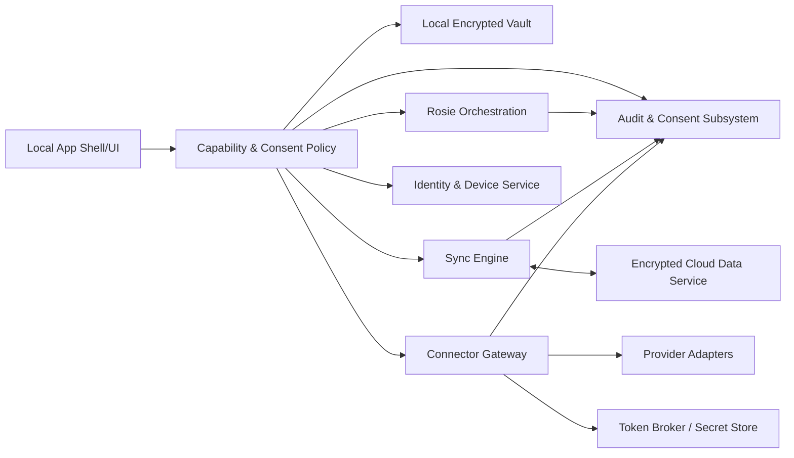

# PHASE 4 PLAN — Connected, Multi-Device iMOS (Architecture Gate)

## 0. Gate scope and baseline

- **Scope:** Architecture and planning only.
- **No implementation in this PR:** no connector code, no cloud SDKs, no auth libraries, no network calls, no production dependency additions.
- **Phase 3 baseline tag:** `phase-3-complete`
- **Verified baseline commit:** `4b34c4385c66f42bebcdf196fbc650088e694827`
- **Planning branch intent:** `phase-4/planning` from verified `main` lineage containing the baseline commit.

---

## 1. Phase 4 purpose

Phase 4 evolves iMOS from a local-only operating companion into an **operator-controlled, multi-device, integration-capable platform** while preserving local-first security and explicit authority boundaries.

Phase 4 capabilities are distinct authorities and must never collapse into a single implicit permission:

1. **Synchronization** — encrypted state propagation between operator-approved devices.
2. **Backup and recovery** — continuity and restore controls for encrypted state.
3. **External-source ingestion** — read/import from approved providers.
4. **Outbound actions** — prepared or executed external side effects, always separately authorized.
5. **Media playback/entitlement access** — provider-authorized content access under licensing constraints.
6. **Cognitive analysis** — explicit consent to analyze selected data classes.
7. **Presentation personalization** — optional UI adaptation from operator-confirmed understanding.

---

## 2. Non-negotiable principles (architectural invariants)

1. Local-first operation.
2. Operator ownership of data and authority.
3. Explicit opt-in per capability and per connector.
4. Least-privilege authorization.
5. End-to-end encryption for private synchronized content where server-side processing is not required.
6. No plaintext operator vault stored server-side.
7. No silent data capture.
8. No silent outbound action.
9. No inferred consent.
10. Provenance on imported information and derived artifacts.
11. Revocable connector access.
12. Deterministic behavior where practical and safety-relevant.
13. Offline usability remains first-class.
14. Recoverable, reversible migrations.
15. Fail-closed validation.
16. Auditable authority changes.
17. Separation of observation, recommendation, approval, execution.

---

## 3. Trust-boundary transition

Builds 003–016A enforced blanket app-side network prohibition.  
Phase 4 replaces that blanket with a **capability-gated network boundary**:

- Network denied by default.
- Only approved adapter runtime receives scoped network capability.
- Core domain services remain network-independent.
- UI cannot call external services directly.
- Endpoints are allowlisted and policy-checked.
- Connector traffic is attributable (connector/account/device/session IDs in audit-safe form).
- Unauthorized network primitive tests remain mandatory and evolve to capability-policy tests.
- Connector failures cannot corrupt local vault (quarantine + transaction boundaries).
- Connector disable/revoke immediately blocks further access/token use.

**Security test evolution**

- Keep: no secret leakage tests, fail-closed validation tests, migration/recovery boundaries, authority-bound tests.
- Evolve: blanket no-network test to "no unauthorized network access" + "only approved adapter/runtime may egress to allowlisted endpoints" tests.

---

## 4. Proposed system boundaries

### Local encrypted vault
- Holds operator records and cognitive artifacts.
- Decrypted only in local runtime memory.
- **Prohibited:** direct cloud persistence of plaintext.

### Local application shell
- UI orchestration, local policy enforcement, approval UX.
- **Prohibited:** direct provider API calls.

### Sync engine
- Encrypt/decrypt sync payload envelopes, conflict detection, reconciliation workflows.
- **Prohibited:** connector token handling.

### Encrypted cloud data service
- Stores ciphertext envelopes, metadata indexes, tombstones, version vectors.
- **Prohibited:** plaintext vault access.

### Identity and device-registration service
- Operator identity, device enrollment/revocation, attestation metadata.
- **Prohibited:** vault data reads.

### Connector gateway
- Controlled execution plane for provider adapter traffic with policy/consent checks.
- **Prohibited:** unrestricted Rosie authority.

### Provider adapters
- Per-provider isolated logic; strict scope and endpoint policy.
- **Prohibited:** cross-provider token reuse.

### Token broker / secret store
- Token lifecycle and wrapping; minimal access API.
- **Prohibited:** cognitive analytics and domain decision logic.

### Rosie orchestration layer
- Observation/proposal/recommendation pipeline.
- **Prohibited:** implicit execution rights from connector enablement.

### Application/module platform
- Capability-declared modules with storage/permission namespaces.
- **Prohibited:** hidden connector or cognitive access.

### Audit and consent subsystem
- Versioned consent records and tamper-evident audit chains.
- **Prohibited:** secret-content logging.

---

## 5. Multi-device identity and synchronization

### Identity/device model
- Operator account identity with enrolled devices.
- Device identity includes key wrapping identity and revocation status.
- Lost-device response: immediate revocation, rekey policy, replay rejection.

### Key/access roles
- Passphrase: local vault unlock.
- Recovery key/material: account/device recovery workflows, separately consented and audited.

### Sync semantics
- Offline-first local write-ahead model.
- Deterministic conflict detection via record-type merge strategy + version vectors.
- Tombstones propagated with retention window and anti-resurrection checks.
- Schema/version negotiation and migration ordering required before acceptance.
- Replay/rollback protection on sync envelopes.
- Corrupt payload quarantine and integrity verification before merge.

### Conflict classes
- **Auto-merge candidates:** append-only audit records, immutable event logs, non-overlapping list additions.
- **Operator-review required:** same-field edits on priorities/commitments/decisions, mission state transitions, consent/authority records, connector policy records, cognitive contract states.

---

## 6. Encryption and key architecture

- Client-side encryption for vault-private and synchronized-private classes.
- Data Encryption Keys (DEKs) per dataset/namespace; Key Encryption Keys (KEKs) per device/account context.
- Device-specific key wrapping for sync participation.
- Passphrase-derived protection for local unlock.
- Recovery material separated from routine operation paths.
- Key rotation on schedule + security events (device loss/revocation).
- Cryptographic versioning and algorithm agility built into payload envelopes.
- Encrypted metadata where possible; explicit list of unavoidable server-visible metadata.

**Cloud can learn (minimum necessary):**
- ciphertext blob sizes/timestamps, device IDs, envelope/version metadata, connector event counters.

**Cloud cannot learn:**
- vault plaintext content, decrypted secrets, passphrase, cognitive content plaintext (except explicitly consented non-E2E connector-processing flows).

**Important boundary:** flows requiring connector-side provider interaction are classified separately and are not labeled true E2E for those specific processing paths.

---

## 7. Microsoft 365 integration architecture

Independent adapters + consent scopes for:

- Outlook Mail (read scope separated from send scope)
- Outlook Calendar (read scope separated from write scope)
- Microsoft To Do
- OneDrive
- SharePoint
- Teams
- Contacts/directory only where justified by explicit purpose

Design requirements:

- Microsoft identity integration with tenant-aware policy.
- Delegated permissions with incremental consent.
- Token storage via token broker boundary.
- Refresh token handling and rotation policy.
- Webhook/subscription validation and renewal controls.
- Delta sync support and provenance stamping.
- Personal vs organizational tenant policy separation.
- Shared/delegated resource handling with explicit visibility.
- Residency-aware storage controls.
- Revocation must terminate use immediately.
- Outbound actions require separate approval pathway.

---

## 8. Financial integrations (high-risk, read-only default)

- Read-only architecture baseline for Robinhood/future providers.
- Supported data boundaries explicitly enumerated.
- No scraping/undocumented private API as default.
- Provenance and freshness indicators required.
- Reconciliation and delayed/incomplete data behavior defined.
- Strong rate-limit/error handling and provider-terms compliance.
- Explicit prohibition: no trading/money movement in Phase 4.

---

## 9. Media and application platform

Module architecture supports future domains (music, audiobooks, podcasts, personal media, notes, communications, productivity, finance, optionally wellness later).

Each module must declare:

- manifest, capabilities, permissions
- storage namespace and sync eligibility
- navigation registration
- background-work limits
- connector dependencies
- media session integration constraints
- download/cache policy
- DRM/entitlement boundaries
- uninstall + data deletion behavior
- module version compatibility
- default isolation from cognitive data

iMOS remains a unified operator experience on authorized services, not a bypass of provider operating systems/licensing.

---

## 10. Rosie authority model

Preserved pipeline:

**observation → provenance → proposed understanding → operator review → recommendation → operator approval → execution**

Separate consent is required for:

- import
- analysis
- retention of derived data
- recommendation generation
- preparing external action
- executing external action

Connector enablement must not grant automatic execution authority.

---

## 11. Data classification and retention model

| Class | Storage | Encryption | Sync Eligible | Cognitive Eligible | Export/Delete | Logging |
|---|---|---|---|---|---|---|
| vault-private | local vault | required | opt-in encrypted | explicit opt-in | full export/delete | content redacted |
| synchronized-encrypted | local + cloud ciphertext | required | yes | explicit opt-in | export + remote tombstone | metadata only |
| connector-transient | memory/ephemeral queue | required in transit | no by default | no by default | not persisted unless promoted | minimal technical |
| externally sourced | local normalized + provenance | required at rest | opt-in | separate consent | export with provenance | no secrets |
| derived cognitive | local by default | required | opt-in encrypted | yes (if consented) | export/delete with lineage | decision-safe summaries |
| public | local/cache | optional | optional | optional | export/delete | standard |
| secret credential | token broker/secret store | required | no plaintext sync | never | revocation + secure delete | never log secret |
| audit | append-only local + optional secure remote | integrity-protected | yes (policy) | no | export privacy-filtered | structured, no secrets |
| media cache | module namespace | required where licensed | policy-driven | no by default | clearable | no entitlement secrets |

---

## 12. Consent and permission model

Consent records must include:

- connector
- account/tenant
- granted scopes
- purpose
- data categories
- allowed operations
- cognitive-use permission
- retention policy
- granted timestamp
- expiration
- revocation state
- provenance
- policy version

Consent is versioned, revocable, and must be revalidated on scope/purpose changes.

---

## 13. Audit architecture

Tamper-evident, privacy-preserving coverage for:

- device enrollment/revocation
- sync operations and conflicts
- consent changes
- connector authorization/revocation
- imports and outbound actions
- key rotation and recovery events
- migrations/rollback actions
- admin/policy changes
- Rosie proposals/approvals/executions

No secrets or unnecessary payload content in audit records.

---

## 14. Failure and recovery model

Fail-safe behavior for:

- cloud unavailable
- connector unavailable
- token expiration
- tenant revocation
- incorrect device clock
- conflicting edits
- schema incompatibility
- migration failure
- corrupted ciphertext
- replay attempts
- partial connector import
- lost device
- compromised credential
- provider rate limits/API changes

All failure paths preserve last known-good local vault and keep local-only operation available.

---

## 15. Migration and rollback

Transition from Build 016A is additive:

- preserves existing operator data
- local-only mode remains fully functional
- no forced cloud enrollment
- no automatic upload
- explicit sync enablement required
- dry-run migration support
- validate-before-commit
- encrypted backup continuity
- rollback before irreversible server effects
- migration provenance records
- compatibility retained for Builds 003–016A

---

## 16. Proposed delivery sequence (Phase 4)

### Build 017 — Connectivity capability framework and network-policy enforcement
- Purpose: establish deny-by-default networking boundary.
- Included: capability policy, allowlist model, unauthorized network detection tests.
- Excluded: real connectors/cloud sync execution.

### Build 018 — Identity, device enrollment, local sync model
- Included: identity/device schema, enrollment/revocation workflows, local sync state model.

### Build 019 — Encrypted cloud-sync transport and conflict quarantine
- Included: envelope protocol, integrity checks, replay protection, quarantine path.

### Build 020 — Multi-device synchronization and recovery controls
- Included: merge/review workflows, tombstones, device-loss/recovery controls.

### Build 021 — Connector framework, consent registry, token boundary
- Included: connector runtime contracts, granular consent schema, token broker boundary.

### Build 022 — Microsoft 365 read-only pilot
- Included: least-privilege read scopes, provenance/freshness, revocation flow.
- Excluded: outbound write actions.

### Build 023 — Reviewed outbound-action workflow
- Included: prepare/approve/execute split, explicit approval controls.

### Build 024 — Financial read-only adapter foundation
- Included: read-only financial ingestion architecture with strict risk controls.

### Build 025 — Media and module-platform foundation
- Included: module manifest/capability model, namespace isolation, entitlement boundaries.

### Build 026 — Phase 4 consolidation and release gate
- Included: security, migration, recovery, performance finalization and release readiness.

---

## 17. Testing strategy

Required coverage plan:

- unit tests
- property-based sync tests
- migration tests
- cryptographic compatibility tests
- connector contract tests
- mocked provider tests
- permission tests
- negative security tests
- replay/tampering tests
- conflict tests
- offline tests
- recovery tests
- accessibility tests
- performance tests
- browser smoke tests
- multi-device E2E tests

No real provider credentials or operator data in test suites.

---

## 18. Open decisions and risks (decision register)

1. Cloud hosting model and operator trust posture.
2. Server ownership/control model.
3. Identity provider strategy.
4. Key recovery tradeoffs (security vs recoverability).
5. Acceptable server-visible metadata envelope.
6. Conflict semantics by record type.
7. Microsoft tenant policy constraints and enterprise controls.
8. Robinhood/provider API availability and terms viability.
9. Module sandboxing depth and runtime isolation model.
10. Media licensing/DRM boundaries.
11. Operating cost limits and scaling profile.
12. Telemetry policy (default minimal, privacy-preserving).
13. Privacy/legal obligations by region/provider.
14. Breach response workflows and disclosure obligations.
15. Account deletion/export guarantees for synchronized states.

**Implementation blockers for Build 017:**  
Decisions 1, 3, 5, and 8 must be resolved or constrained by explicit assumptions before execution scope is finalized.

---

## 19. Phase 4 definition of done

Phase 4 is complete only when:

- encrypted, tested, recoverable multi-device sync is proven
- local-only mode remains fully supported
- device revocation is verified
- conflict handling is safe
- migrations preserve existing data
- networking stays capability-controlled
- Microsoft 365 least-privilege model is enforced
- external actions require separate approval
- financial integration remains read-only
- connector revocation works
- operator export/deletion works
- Rosie authority remains bounded
- security/recovery/migration/performance gates pass
- final consolidation is merged and tagged

---

## 20. Architecture-gate checklist

- [x] Mission alignment
- [x] Scope and exclusions
- [x] Trust boundaries
- [x] Security invariants
- [x] Privacy boundaries
- [x] Identity model
- [x] Encryption/key model
- [x] Synchronization model
- [x] Conflict handling strategy
- [x] Connector architecture
- [x] Microsoft 365 plan
- [x] Finance integration constraints
- [x] Media/module platform boundaries
- [x] Rosie authority model
- [x] Migration strategy
- [x] Rollback strategy
- [x] Testing strategy
- [x] Operations/reliability framing
- [x] Legal/provider-constraint coverage
- [x] Unresolved blockers listed
- [ ] Build 017 readiness (blocked pending planning PR review + blocker resolution)

---

## Build 017 start gate

Build 017 may begin only after:

1. This Phase 4 planning PR is reviewed.
2. Architecture blockers affecting Build 017 are resolved.
3. Required checks are green.
4. Planning PR is merged into `main`.
5. Updated `main` is verified.
6. Explicit Build 017 implementation prompt is approved.

