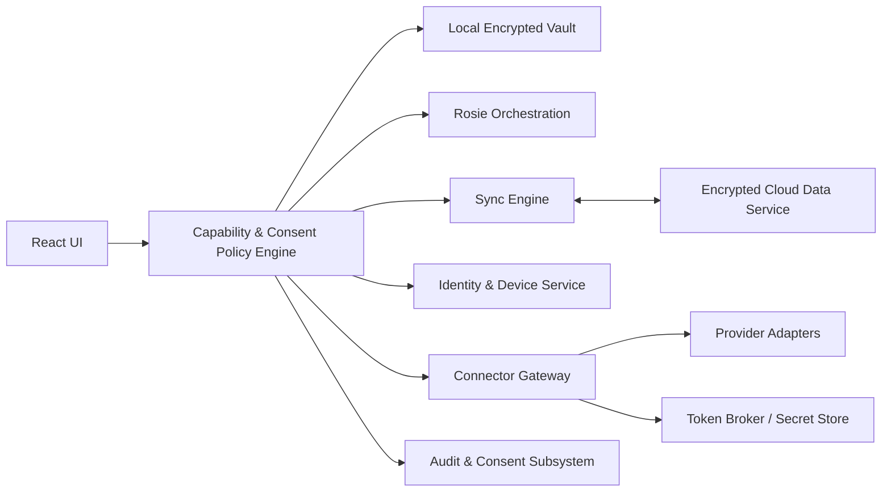

# PHASE 4 PLAN — Architecture Gate (Documentation Only)

## 0) Gate scope and verified baseline

- Repository: `robepur/iMOS`
- Planning branch: `phase-4/planning`
- Base lineage commit: `4b34c4385c66f42bebcdf196fbc650088e694827` (`phase-3-complete`)
- Scope: architecture/planning only
- Out of scope: Build 017 implementation code, dependencies, workflows, runtime behavior, production endpoints

This document hardens Phase 4 architecture and release gating. It does **not** authorize implementation yet.

---

## 1) Phase 4 purpose

Phase 4 evolves iMOS from a local-only operating companion into an operator-controlled, multi-device, integration-capable system while preserving local-first security and bounded Rosie authority.

These authorities remain explicitly separate:

1. Synchronization
2. Backup/recovery
3. External-source ingestion
4. Outbound actions
5. Media playback/entitlement
6. Cognitive analysis
7. Presentation personalization

Enabling one authority does not imply any other.

---

## 2) Non-negotiable architectural invariants

1. Local-first operation remains fully supported.
2. Operator owns data and authority decisions.
3. Explicit opt-in per capability and per connector.
4. Least privilege by scope and operation.
5. End-to-end encryption for private synchronized content where server-side decryption is not required.
6. No plaintext operator vault on servers.
7. No silent capture, no silent outbound action, no inferred consent.
8. Provenance required for imported and derived data.
9. Revocable connector access with immediate effect.
10. Deterministic behavior where safety relevant.
11. Fail-closed validation and policy evaluation.
12. Recoverable/reversible migrations.
13. Auditable authority and policy changes.
14. Separation of observation → recommendation → approval → execution.

---

## 3) Trust-boundary transition (Builds 003–016A to Phase 4)

Builds 003–016A used blanket network prohibition.  
Phase 4 replaces blanket prohibition with **capability-gated network control**:

- Default deny for all networking.
- Only approved adapter boundary can request network access.
- Core domain services remain network-independent.
- React/UI components cannot call external services directly.
- Endpoints/origins/paths/methods are allowlisted, deterministic, and auditable.
- Unauthorized primitives fail closed.
- Connector failure cannot mutate/corrupt last known-good vault.
- Capability/consent disable revokes new requests immediately.

Existing security tests remain; blanket no-network tests evolve to “no unauthorized networking” tests with explicit adapter-policy assertions.

---

## 4) System boundaries and prohibited behavior

### Local encrypted vault
- Stores operator private records and derived local state.
- Prohibited: plaintext server persistence.

### Local application shell
- UI, local policy checks, operator approvals.
- Prohibited: direct provider API usage.

### Capability/policy engine
- Evaluates capability + consent + endpoint policy deterministically.
- Prohibited: best-effort fallbacks on policy failure.

### Sync engine
- Envelope/version/replay/integrity logic; conflict workflows.
- Prohibited: connector-token ownership.

### Encrypted cloud data service
- Ciphertext envelopes + minimal metadata.
- Prohibited: vault plaintext access.

### Identity/device service
- Operator identity and device registration lifecycle.
- Prohibited: connector identity conflation or vault content access.

### Connector gateway
- Executes approved connector requests through provider adapters.
- Prohibited: implicit outbound authority.

### Provider adapters
- Provider-specific scope-limited integrations.
- Prohibited: undeclared URLs/scopes/operations.

### Token broker/secret store
- Connector credential handling and rotation boundaries.
- Prohibited: exposing credentials to UI/domain services.

### Rosie orchestration
- Observation/provenance/proposal/recommendation pipeline.
- Prohibited: execution without explicit operator approval.

### Audit + consent subsystem
- Tamper-evident authority trail and consent lifecycle.
- Prohibited: logging secret material or unnecessary content.

---

## 5) Multi-device identity and synchronization architecture

- Separate identities:
  - iMOS operator identity (platform identity)
  - connector account identities (provider identities)
- Device enrollment/revocation with wrapped key distribution.
- Passphrase for local unlock; recovery material for controlled recovery flows.
- Offline-first local operations; explicit sync enablement required.
- Conflict strategy by record type (not global last-write-wins).
- Tombstones, replay protection, rollback protection, integrity verification.
- Corrupt payload quarantine before vault mutation.

### Conflict handling classes

**Auto-merge candidates:** append-only audit/event streams, non-overlapping list additions.  
**Operator-review required:** same-field edits on priorities/commitments/decisions/missions, consent/authority state, cognitive contract state, connector policy records.

---

## 6) Encryption and key architecture

- Client-side encryption first.
- DEK/KEK layering with device-specific key wrapping.
- Passphrase-derived local protection.
- Recovery material separate from routine keys.
- Rotation on schedule and security events (revocation/loss/compromise).
- Cryptographic versioning and algorithm agility in envelope schema.

### Cloud knowledge boundary

Cloud may learn only minimal operational metadata (defined in Section 8).  
Cloud may not learn vault plaintext, passphrase, or secret values.

For flows requiring connector-side processing, do not label those specific flows as E2E for content processed outside client-only decrypt context.

---

## 7) Microsoft 365 integration boundary (Phase 4 plan)

Independent adapters/scopes for:

- Outlook Mail
- Outlook Calendar
- Microsoft To Do
- OneDrive
- SharePoint
- Teams
- Contacts/directory only when justified

Required controls:

- incremental consent
- least-privilege delegated scopes
- tenant-aware restrictions
- read scope separate from write scope
- provenance/freshness marking
- immediate revocation effect
- outbound actions require separate approval gate

Reading email does not authorize sending.  
Reading calendars does not authorize creating/updating events.

---

## 8) Minimum server-visible metadata envelope (reviewed boundary)

Expansion of this envelope is a reviewed architecture change.

| Field | Purpose | Retention | Deletion behavior | Privacy exposure |
|---|---|---|---|---|
| envelope_id | idempotency + replay defense | 90d rolling | hard delete or tombstone expiry | low |
| operator_id_hash | account routing without plaintext identifier | account lifetime + deletion SLA | erased on account deletion workflow completion | medium (linkability) |
| device_id | device routing/revocation checks | device lifetime + 90d | erased after revocation retention | medium |
| key_version | decrypt/unwrap compatibility | payload lifetime | removed with payload deletion | low |
| schema_version | migration/version negotiation | payload lifetime | removed with payload deletion | low |
| vector_clock / seq | sync conflict/replay ordering | payload lifetime | removed with payload deletion | medium (activity timing) |
| payload_ciphertext_len | abuse/rate/transport handling | 30d aggregated logs | log retention expiry | low |
| created_at / received_at | replay window + operational debugging | 90d | log retention expiry | medium (timing) |
| request_id | attribution/correlation | 90d | log retention expiry | low |
| capability_id | policy/audit attribution | 90d | log retention expiry | low |
| adapter_id | adapter attribution | 90d | log retention expiry | low |
| purpose_code | consent/policy binding | 90d | log retention expiry | low |
| status_code_class | abuse and reliability controls | 30d aggregated | retention expiry | low |

Rules:

- No content-derived metadata when avoidable.
- No plaintext payload snippets.
- No secret/token material.
- Metadata is minimized, documented, and review-gated.

---

## 9) Financial integration boundary

Financial integrations remain read-only by default.  
No trading/money movement in Phase 4.

### Build 024 entry blocker (not Build 017 blocker)

Before Build 024 implementation:

1. Provider API availability documented.
2. Authorization method documented.
3. Terms/permitted use documented.
4. Retention/rate-limit constraints documented.
5. Read-only operation boundary verified.

Scraping and undocumented private APIs are prohibited.

---

## 10) Media/module platform (de-scoped to necessary foundation)

Phase 4 defines a **bounded module contract**, not an unrestricted plugin runtime.

Each module declares:

- manifest + version
- capabilities + permissions
- storage namespace
- connector dependency declarations
- background job limits
- uninstall/data deletion contract

No module can bypass connector policy, Rosie authority sequence, or consent boundaries.

---

## 11) Rosie authority model

Mandatory sequence:

**observation → provenance → proposed understanding → operator review → recommendation → operator approval → execution**

Separate consent required for:

- import
- analysis
- retention of derived data
- recommendation generation
- preparing external action
- executing external action

Connector enablement alone never grants execution authority.

---

## 12) Data classification and retention

| Class | Storage | Encryption | Sync eligibility | Cognitive eligibility | Deletion/export | Logging restrictions |
|---|---|---|---|---|---|---|
| vault-private | local vault | required | opt-in only | explicit opt-in | full export/delete | redact content |
| synchronized-encrypted | local + cloud ciphertext | required | yes | explicit opt-in | tombstone + deletion workflow | metadata only |
| connector-transient | ephemeral memory/queue | in-transit required | no default | no default | drop on completion/failure | technical only |
| externally sourced | local with provenance | required | opt-in by class | separate consent | export with provenance | no secrets |
| derived cognitive | local default | required | opt-in | yes if consented | delete with lineage cleanup | summary-only |
| secret credential | token broker/store | required | no plaintext sync | never | revoke/rotate/delete | never log |
| audit | append-only integrity-protected | required | policy-driven | no | privacy-filtered export | no secrets |
| media cache | module namespace | policy-driven | policy-driven | no default | clearable | no entitlement secrets |

---

## 13) Consent and permission model

Consent records include:

- connector
- account/tenant
- granted scopes
- purpose
- data categories
- allowed operations
- cognitive-use permission
- retention policy
- granted timestamp
- expiration
- revocation state
- provenance
- policy version

Consent changes are versioned, revocable, revalidated on scope/purpose changes, and audited.

---

## 14) Audit architecture

Tamper-evident audit coverage:

- device enrollment/revocation
- sync operations/conflicts/quarantine
- consent changes
- connector authorization/revocation
- outbound action approvals/executions
- key rotation/recovery
- migrations/rollback
- policy/admin changes
- Rosie proposals/approvals

No secrets or unnecessary content are written to audit records.

---

## 15) Failure and recovery model

Defined failure handling for:

- cloud/connector unavailability
- token expiration or tenant revocation
- bad device clock
- conflicts
- schema incompatibility
- migration failure
- corrupted ciphertext
- replay attempts
- partial imports
- lost/compromised devices
- provider rate limits/API changes

Invariant: preserve last known-good encrypted vault and local-only operability.

---

## 16) Build 017 scope boundary (hardened)

### Build 017 included scope (only)

1. capability-based network policy types/interfaces
2. deny-by-default endpoint policy
3. adapter registration boundaries
4. endpoint allowlisting model
5. request attribution contracts
6. audit-event contracts (redacted)
7. timeout/cancellation contracts
8. deterministic policy evaluation contracts
9. negative security tests
10. additive persistence only if strictly necessary and disabled-by-default
11. documentation

### Build 017 excluded scope (explicitly prohibited)

- production endpoints
- cloud synchronization transport
- operator accounts
- device enrollment
- authentication providers
- OAuth
- token persistence
- Microsoft Graph
- Robinhood and all financial data flows
- media providers
- outbound actions
- telemetry expansion
- app-side networking outside approved adapter boundary
- weakening/removing existing security tests

---

## 17) Build 017 trust model (explicit)

1. Core domain services are network-independent.
2. React components cannot call external services directly.
3. Networking denied unless capability + approved adapter authorize request.
4. Adapters must declare allowed origins, paths, methods, purposes, data classes.
5. Dynamic arbitrary URLs are prohibited.
6. Redirects denied by default or revalidated against policy.
7. Credentials never exposed to UI or domain services.
8. Network responses are untrusted input.
9. Malformed/unauthorized traffic fails closed.
10. Disabling capability/consent prevents new requests immediately.
11. In-flight cancellation contract is mandatory.
12. Network failure cannot mutate/corrupt last known-good vault.
13. No upload occurs merely because networking infrastructure exists.

---

## 18) Build 017 acceptance tests (minimum required)

1. default-deny behavior
2. approved adapter registration
3. undeclared adapter rejection
4. origin allowlist enforcement
5. path/method enforcement
6. dynamic URL rejection
7. redirect validation
8. request attribution presence/format
9. consent/capability revocation effect
10. timeout behavior
11. cancellation behavior
12. malformed response rejection
13. audit redaction
14. credential non-disclosure
15. direct UI networking detection
16. direct domain-service networking detection
17. forbidden primitive detection
18. local-only behavior unchanged
19. Builds 003–016A compatibility retained
20. no production endpoint constants present
21. tests perform no real external requests

---

## 19) Build 017 migration and rollback constraints

- Prefer no persisted-data migration.
- If persistence is required: additive defaults, networking disabled.
- Existing vaults load without operator action.
- No migration can enable connectivity.
- No external side effects during migration.
- Rollback preserves readability of existing operator data.
- Failure preserves last known-good encrypted vault.

---

## 20) Delivery sequencing validation (Builds 017–026)

Validated dependency order:

- Build 017 (policy boundary) precedes all networking-dependent builds.
- Build 018 (identity model) precedes device-enrollment-dependent execution.
- Build 019 (key/envelope/replay/quarantine) precedes production sync behavior.
- Build 020 (multi-device conflict/recovery operations) follows conflict semantics from 019.
- Build 021 (connector consent/token boundaries) precedes provider adapters.
- Build 022 (read-only M365 pilot) precedes outbound action support.
- Build 023 (outbound action workflow) follows read-only baseline and approval chain.
- Build 024 (financial read-only) gated by provider viability evidence.
- Build 025 (module foundation) cannot bypass connector/policy/Rosie controls.
- Build 026 consolidation includes security/privacy/migration/recovery/performance/manual release gates.

---

## 21) Decision register (Phase 4 unresolved decisions)

Only decisions required for Build 017 can block Build 017.

| Decision | Current status | Options | Selection criteria | Responsible release gate | Deadline build | Consequence of deferral |
|---|---|---|---|---|---|---|
| Cloud hosting model for sync-plane | Deferred, non-blocking for B017 | managed cloud / self-hosted / hybrid | threat model fit, ops burden, residency, cost, incident response | Build 019 entry gate | Build 018 end | Blocks hosted sync execution start |
| Identity provider for iMOS operator identity | Deferred, non-blocking for B017 | self-issued creds / external IdP / federated hybrid | recovery, lockout risk, enterprise compatibility, privacy | Build 018 entry gate | Build 018 start | Blocks device enrollment execution |
| Server-visible metadata envelope finalization | Partially resolved here; review-gated | minimal listed set only / expanded set by approval | privacy minimization, replay defense, sync correctness | Build 019 architecture gate | Build 019 start | Blocks hosted sync if unapproved expansion needed |
| Key recovery policy depth | Deferred | operator-only recovery / escrow-assisted / split-trust | compromise blast radius, usability, legal constraints | Build 020 gate | Build 019 end | Recovery UX limited until resolved |
| Conflict semantics by record type | Deferred detail, framework defined | per-type auto-merge / manual review / hybrid | safety, reversibility, operator burden | Build 020 gate | Build 019 end | Blocks production multi-device rollout |
| Microsoft tenant policy constraints | Deferred | personal-only / org-only / mixed with policy layers | compliance, permission model, supportability | Build 022 gate | Build 021 end | Limits M365 rollout scope |
| Financial provider viability | Deferred, **not B017 blocker** | providers with documented public APIs only | API availability, auth method, terms, retention, rate limits, permitted use | Build 024 entry gate | Build 024 start | Blocks financial adapter implementation |
| Module sandbox depth | Deferred | strict process isolation / capability-only boundary / hybrid | safety, complexity, performance | Build 025 gate | Build 024 end | Limits module expansion risk posture |
| Telemetry/privacy policy detail | Deferred | local-only metrics / aggregate opt-in / none | privacy, legal, ops visibility | Build 026 gate | Build 025 end | May delay release sign-off |

---

## 22) Build 017 blocker-resolution table

| Prior blocker | Resolution in this gate | Blocks Build 017 now? |
|---|---|---|
| Cloud hosting model | Keep B017 provider-neutral; interfaces/capability boundaries only; decision deferred to Build 019 gate with criteria/deadline defined | No |
| Identity-provider strategy | Keep B017 identity-neutral; no auth SDK assumptions; separate iMOS identity from connector identities; defer to Build 018 gate | No |
| Server-visible metadata | Minimum envelope explicitly documented with purpose/retention/deletion/privacy; expansion requires architecture review | No |
| Financial provider viability | Reclassified to Build 024 entry blocker; read-only only; documented API/terms/auth prerequisites required | No |

---

## 23) Testing strategy (Phase 4)

Coverage classes across builds:

- unit
- property-based sync
- migration
- cryptographic compatibility
- connector contracts
- mocked provider tests
- permission/authority tests
- negative security tests
- replay/tamper tests
- conflict tests
- offline tests
- recovery tests
- accessibility
- performance
- browser smoke
- multi-device E2E

No real provider credentials or operator data in tests.

---

## 24) Phase 4 definition of done

Phase 4 is complete only when:

- encrypted multi-device sync is tested/recoverable
- local-only mode remains fully supported
- device revocation verified
- safe conflict handling verified
- migration compatibility preserved
- capability-controlled networking enforced
- least-privilege M365 behavior enforced
- outbound actions require explicit approval
- finance integrations remain read-only
- connector revocation works
- export/deletion works
- Rosie authority remains bounded
- security/privacy/migration/recovery/performance gates pass
- final consolidation merged with release validation complete

---

## 25) Architecture-gate checklist

- [x] mission alignment
- [x] scope and exclusions
- [x] trust boundaries
- [x] security/privacy boundaries
- [x] provider neutrality for Build 017
- [x] Build 017 trust model
- [x] Build 017 include/exclude scope
- [x] Build 017 acceptance tests
- [x] migration + rollback constraints
- [x] sequencing validation (017–026)
- [x] decision register with deadlines and gates
- [x] blocker-resolution table
- [ ] Build 017 readiness (requires PR merge + post-merge green + no new B017 blockers)

---

## 26) Build 017 start gate

Build 017 may begin only after:

1. PR #21 (this plan) is reviewed and merged into `main`.
2. Post-merge required checks are green.
3. No Build 017-specific architecture blocker remains.
4. Explicit Build 017 implementation prompt is approved.

